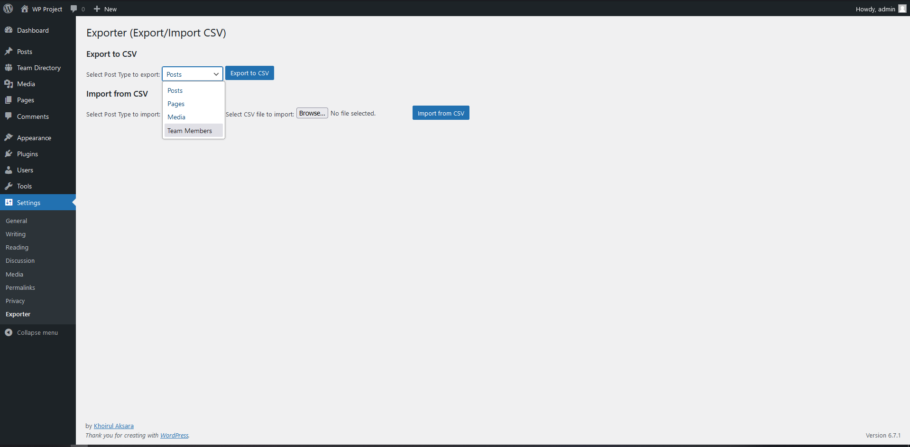

# Exporter

A plugin to dynamically export and import Posts, Pages, Custom Post Types (CPT) and Custom Fields in CSV format.

## Description

A WordPress plugin designed to provide users with a seamless way to export and import content, including Posts, Pages, Custom Post Types (CPTs), and their associated Custom Fields, into a CSV format. This functionality allows for efficient data transfer, backup, and restoration of site content, enabling users to easily manage and migrate structured information between WordPress installations or external tools with minimal effort.

## Installation

1. Upload the plugin files to the `/wp-content/plugins/exporter` directory, or install the plugin through the WordPress plugins screen directly.
2. Activate the plugin through the 'Plugins' screen in WordPress.
3. Use the Settings -> Exporter screen to configure the plugin.

## Frequently Asked Questions

# How is the uploaded csv format field?

Download this template [Template CSV](assets/csv/template.csv).

## Screenshots

1. Plugin setting

   

## Changelog

# 1.0 =

- Initial release of the Exporter plugin.
- Features include dynamically export and import Posts, Pages, Custom Post Types (CPT) and Custom Fields in CSV format.

## Upgrade Notice

# 1.0 =
None.
